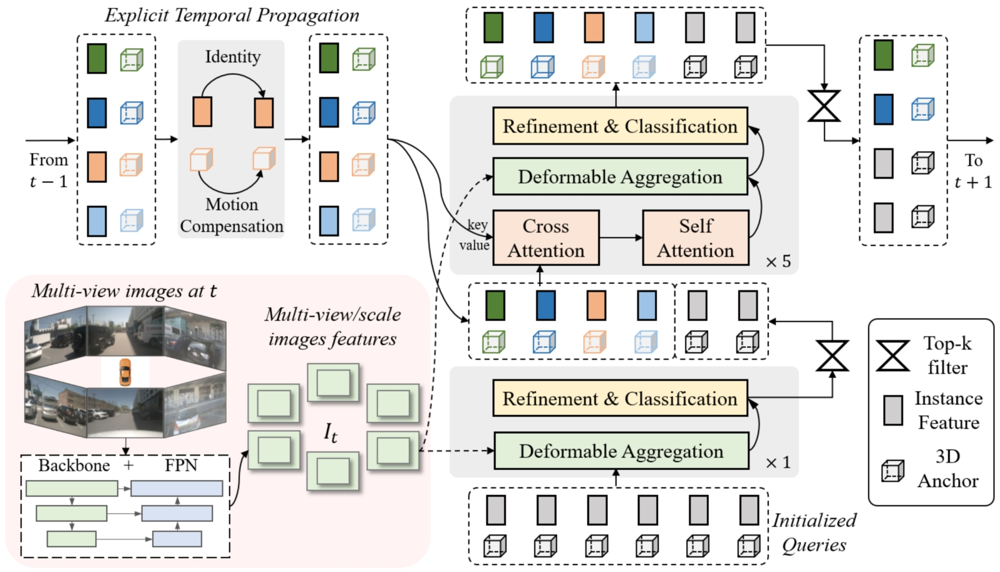
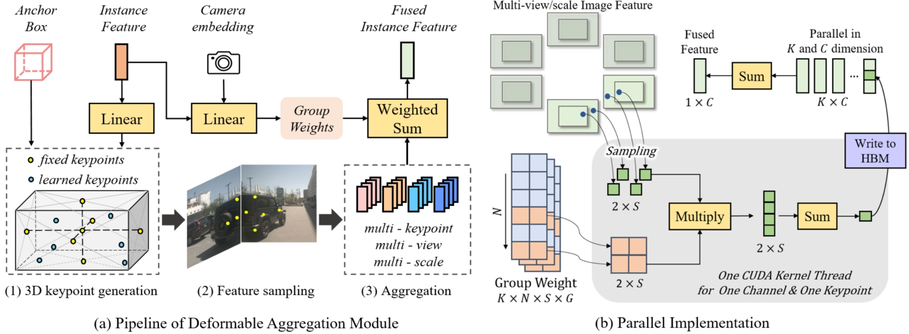

<div align="center">   
  
# Sparse4D: Sparse-based End-to-end Multi-view Temporal Perception
</div>

> [Github](https://github.com/HorizonRobotics/Sparse4D) \
> [Sparse4D v1: Multi-view 3D Object Detection with Sparse Spatial-Temporal Fusion](https://arxiv.org/abs/2211.10581) \
> [Sparse4D v2: Recurrent Temporal Fusion with Sparse Model](https://arxiv.org/abs/2305.14018) \
> [Sparse4D v3: Advancing End-to-End 3D Detection and Tracking](https://arxiv.org/abs/2311.11722) \
> [Chinese Interpretation of the Papers](https://zhuanlan.zhihu.com/p/637096473)

## Overall Architecture
<center>
    
    <br>
    <div style="color:orange; border-bottom: 1px solid #d9d9d9;
    display: inline-block;
    color: #999;
    padding: 2px;">Overall Framework of Sparse4D, which conforms to an encoder-decoder structure. The inputs mainly consists of three components: multi-view images, newly initialized instances, propagated instances from previous frame. The output is the refined instances (3D anchor boxes and corresponding features), serve as the perception results for the current frame. Additionally, a subset of these refined instances is selected and propagated to the next frame.</div>
</center>


<center>
    
    <br>
    <div style="color:orange; border-bottom: 1px solid #d9d9d9;
    display: inline-block;
    color: #999;
    padding: 2px;"> Illustration of our Efficient Deformable Aggregation Module. (a) The basic pipeline: we first generate multiple 3D key points inside 3D anchor, then sampling multi-scale/view image feature for each keypoint, and fuse these feature with predicted weight. (b) The parallel implementation: to further improve speed and reduce memory cost, we achieve a parallel implementation, where feature sampling and multi-view/scale weighted sum are combined as a CUDA operation. Our CUDA implementation supports handling different feature resolutions from different views. </div>
</center>


## nuScenes Benchmark
### Results on Validation Split
These experiments were conducted using 8 RTX 3090 GPUs with 24 GB memory.
|model | backbone |pretrain| img size | Epoch | Traning | FPS | NDS | mAP |  AMOTA |AMOTP |IDS| config | ckpt | log |
|  :----:  | :---: | :---: | :---: | :---: | :---:| :---:|:---:|:---: | :---: | :----: | :----: | :---: | :----: | :----: |
|Sparse4D-T4 |Res101|[FCOS3D](https://github.com/linxuewu/Sparse4D/releases/download/v0.0/fcos3d.pth)|640x1600|24|2Day5H|2.9|0.5438|0.4409|-|-|-|[cfg](https://github.com/linxuewu/Sparse4D/blob/v2.0/projects/configs/sparse4d_r101_H4.py)|[ckpt](https://github.com/linxuewu/Sparse4D/releases/download/v0.0/sparse4dv1_r101_H4_release.pth)|[log](https://github.com/linxuewu/Sparse4D/releases/download/v0.0/sparse4d.log)|
|Sparse4Dv2|Res50|[ImageNet]()|256x704| 100 |15H | 20.3 |0.5384|0.4392|-|-|-|[cfg](https://github.com/linxuewu/Sparse4D/blob/v2.0/projects/configs/sparse4dv2_r50_HInf_256x704.py)|[ckpt](https://github.com/linxuewu/Sparse4D/releases/download/v0.0/sparse4dv2_r50_HInf_256x704.pth)|[log](https://github.com/linxuewu/Sparse4D/releases/download/v0.0/sparse4dv2_r50_HInf_256x704.log.json)|
|Sparse4Dv2|Res101|[nuImage](https://download.openmmlab.com/mmdetection3d/v0.1.0_models/nuimages_semseg/cascade_mask_rcnn_r101_fpn_1x_nuim/cascade_mask_rcnn_r101_fpn_1x_nuim_20201024_134804-45215b1e.pth)|512x1408| 100 |2Day | 8.4 |0.5939|0.5051|-|-|-|-|-|-|
|Sparse4Dv3|Res50|[ImageNet]()|256x704| 100 |22H | 19.8 |0.5637|0.4646|0.477|1.167|456|[cfg]()|[ckpt](https://github.com/HorizonRobotics/Sparse4D/releases/download/v3.0/sparse4dv3_r50.pth)|[log](https://github.com/HorizonRobotics/Sparse4D/releases/download/v3.0/sparse4dv3_r50.log)
|Sparse4Dv3|Res101|[nuImage](https://download.openmmlab.com/mmdetection3d/v0.1.0_models/nuimages_semseg/cascade_mask_rcnn_r101_fpn_1x_nuim/cascade_mask_rcnn_r101_fpn_1x_nuim_20201024_134804-45215b1e.pth)|512x1408| 100 |2Day | 8.2 |0.623|0.537|0.567|1.027|557|-|-|-|

### Results on Test Split
|model| backbone | img size | NDS | mAP |mATE| mASE | mAOE |mAVE| mAAE | AMOTA |AMOTP |IDS|
| :---: | :---: | :---: | :---: | :---:|:---:|:---: | :---: | :----: | :----: | :----: | :----: | :----: |
|Sparse4D-T4|[VoV-99](https://huggingface.co/Yuxin-CV/EVA-02/blob/main/eva02/det/eva02_L_coco_det_sys_o365.pth)|640x1600|0.595|0.511|0.533|0.263|0.369|0.317|0.124|-|-|-|
|Sparse4Dv2|[VoV-99](https://huggingface.co/Yuxin-CV/EVA-02/blob/main/eva02/det/eva02_L_coco_det_sys_o365.pth)|640x1600|0.638|0.556|0.462|0.238|0.328|0.264|0.115|-|-|-|
|Sparse4Dv3|[VoV-99](https://huggingface.co/Yuxin-CV/EVA-02/blob/main/eva02/det/eva02_L_coco_det_sys_o365.pth)|640x1600|0.656|0.570|0.412|0.236|0.312|0.210|0.117|0.574|0.970|669|
|Sparse4Dv3-offline|[EVA02-large](https://huggingface.co/Yuxin-CV/EVA-02/blob/main/eva02/det/eva02_L_coco_det_sys_o365.pth)|640x1600|0.719|0.668|0.346|0.234|0.279|0.142|0.145|0.677|0.761|514|

## Quick Start
[Quick Start](docs/quick_start.md)

## Citation
```
@misc{2311.11722,
    Author = {Xuewu Lin and Zixiang Pei and Tianwei Lin and Lichao Huang and Zhizhong Su},
    Title = {Sparse4D v3: Advancing End-to-End 3D Detection and Tracking},
    Year = {2023},
    Eprint = {arXiv:2311.11722},
}
@misc{2305.14018,
    Author = {Xuewu Lin and Tianwei Lin and Zixiang Pei and Lichao Huang and Zhizhong Su},
    Title = {Sparse4D v2: Recurrent Temporal Fusion with Sparse Model},
    Year = {2023},
    Eprint = {arXiv:2305.14018},
}
@misc{2211.10581,
    Author = {Xuewu Lin and Tianwei Lin and Zixiang Pei and Lichao Huang and Zhizhong Su},
    Title = {Sparse4D: Multi-view 3D Object Detection with Sparse Spatial-Temporal Fusion},
    Year = {2022},
    Eprint = {arXiv:2211.10581},
}
```

## Acknowledgement
- [BEVFormer](https://github.com/fundamentalvision/BEVFormer)
- [DETR3D](https://github.com/WangYueFt/detr3d) 
- [mmdet3d](https://github.com/open-mmlab/mmdetection3d)
- [SOLOFusion](https://github.com/Divadi/SOLOFusion/tree/main/configs/solofusion)
- [StreamPETR](https://github.com/exiawsh/StreamPETR)
